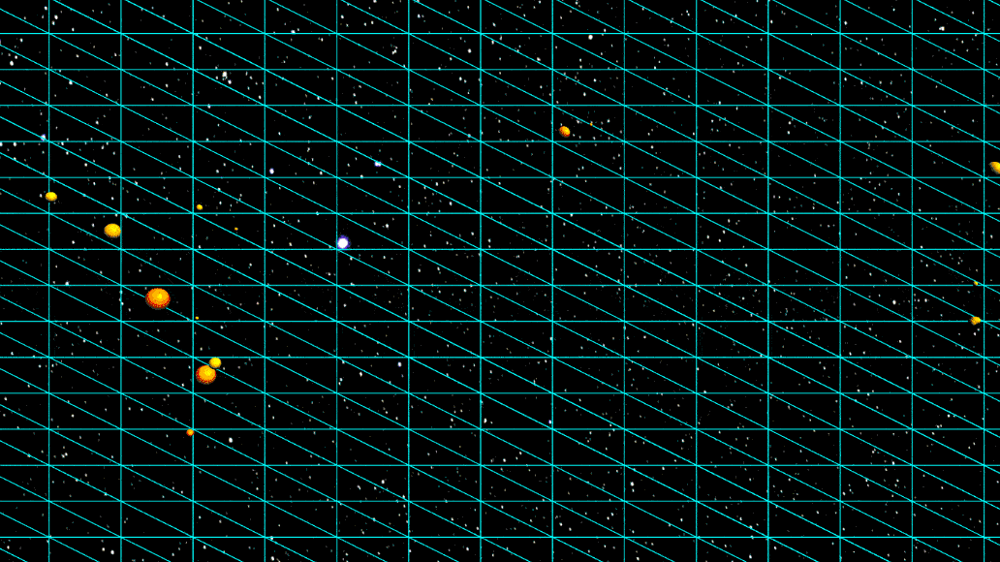

# Earthquake Viewer
Visualize real-world geographical data on a 3D textured globe.

## Demo


## Features
- Flat map mesh and spherical globe mesh
- Mesh texturing with Earth texture
- Morphing between map and globe with smooth animation
- Earthquake markers indicate location and severety

## Build instructions

1. Install [Node.js](https://nodejs.org/).

2. Install dependencies.
```bash
npm install
```

3. Launch development server.
```bash
npm run start
```

## Credit

This game uses royalty-free sound effects from [ZapSplat](https://www.zapsplat.com/).

## Credits
- Earthquake data from http://earthquake.usgs.gov/research/data/centennial.php, [U.S. Geological Survey](http://www.usgs.gov/laws/info_policies.html)
- Photo by [Jeremy Perkins on Unsplash](https://unsplash.com/photos/uhjiu8FjnsQ)

## License

Material for [CSCI 4611 Spring 2024](https://github.com/CSCI-4611-Spring-2024/Syllabus) by [Evan Suma Rosenberg](https://illusioneering.umn.edu/) is licensed under a [Creative Commons Attribution-NonCommercial-ShareAlike 4.0 International License](http://creativecommons.org/licenses/by-nc-sa/4.0/).